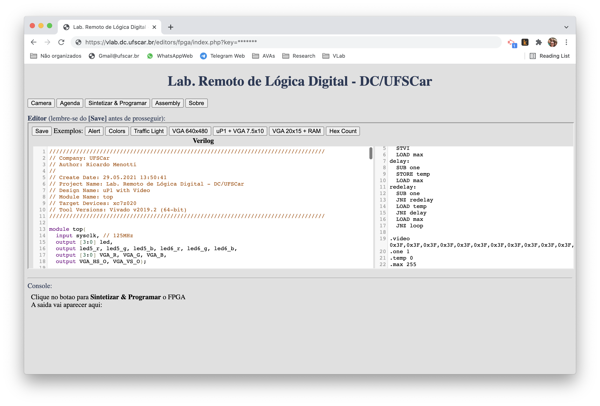
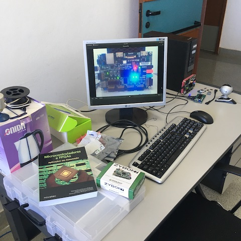
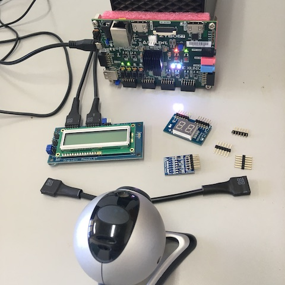
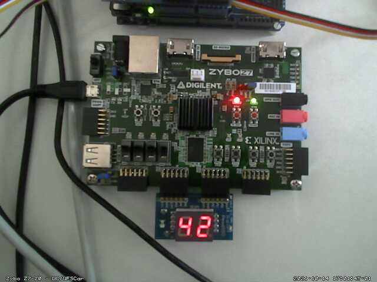

# RemoteEmbeddedLab

A set of PHP files, scripts and database to allow remote users to edit programs and hardware, upload code and access real microcontrollers and FPGAs.

 

  

## Features
- Fully web based solution
- Online web editor
- Examples
- Real time access to the device LEDs, surrounds using a webcam available with motion
- Usage control with scheduling / with / without authorization
- Transparent remote code upload using avrdude or esptool from the web-browser
- Transparent remote bitstream download to the board using Xilinx tools

Tested with Arduino and Zybo boards. It would be easy to use with mBed / STM32 boards using UF2 bootloader

## Dependencies
- CodeMirror (https://github.com/codemirror/CodeMirror)
- LuxCal (https://www.luxsoft.eu/index.php?pge=dload)
- MySQL
- Apache + PHP
- Arduino makefile (https://github.com/sudar/Arduino-Makefile)
- Arduino IDE
- Motion (for webcam) (https://github.com/Motion-Project/motion)
- Xilinx Vivado Suite

## Installation
1. On a Linux machine, install Apache + MySQL + PHP and Apache+PHP+MySQL modules, if you still don't have it
2. Install luxcal (https://www.luxsoft.eu/index.php?pge=dload) on /var/www/html/agenda folder (tested with luxcal 479)
3. Configure luxcal database and SMTP. Test your calendar install and if approved events are senging email
4. Install and configure motion
5. Download and copy CodeMirror (codemirror-5.58.1) to /var/www/html/codemirror-5.58.1
6. Install and configura Xilinx tools  

Thanks to Prof. Rafael Aroca for supporting the [original version](https://github.com/rafaelaroca/RemoteMicrocontrollerLab)!
